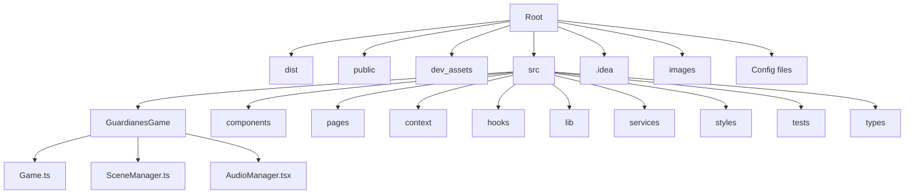

# Tecnologías utilizadas

- **Vite**
- **React + TypeScript**

## Estilos
- `module.css`

## Librerías utilizadas
- `react-router-dom` para navegación
- Google Fonts para la tipografía
- **PixiJS** (WebGL renderer) para pintar las escenas en modo canvas

## Base de datos
- **Appwrite**  
  [Enlace a la documentación oficial](https://appwrite.io/)

## Test unitarios
- **Jest**

## Estructura de la web del juego
- **GameViewport**:  
  - Componente: `GameViewport.tsx`  
  - Estilos: `GameViewport.module.css`

- **Juego**:  
  - Componente principal: `Game.tsx`  
  - Contendrá una clase para almacenar las estructuras y la lógica del juego.

## Modal (para reflexiones del juego)
- **Librería GSAP** para animaciones
- **PixiJS.Graphics()**

---

### Enlaces útiles de PixiJS
- [PIXI Settings Documentation](https://pixijs.download/v4.8.9/docs/PIXI.settings.html)
- [Escalar a pantalla completa en PixiJS](https://coderevue.net/posts/scale-to-fit-screen-pixijs/)

---

## Herramientas para crear la música del juego
- [Soundtrap](https://www.soundtrap.com/es/)
- [Audacity](https://www.audacityteam.org/download/)  
  *(Disponible para Windows, macOS y Linux)*

---

### ⚠️ IMPORTANTE
- Cuando se crea una cuenta nueva con **Appwrite**, se debe cerrar sesión **OBLIGATORIAMENTE** antes de hacer login.

#### ✅ Ejemplo de código:

```typescript
import { Client, Account } from 'appwrite';

const client = new Client()
    .setEndpoint('https://[APPWRITE-ENDPOINT]/v1') // URL de tu Appwrite
    .setProject('[PROJECT_ID]'); // ID del proyecto

const account = new Account(client);

// Cerrar sesión antes de iniciar sesión nuevamente
await account.deleteSession('current');

// Ahora se puede iniciar sesión
await account.createEmailSession('email@example.com', 'password123');
```

---

## 📂 Estructura del proyecto

```
E:.
│   .gitignore
│   README.md
│   eslint.config.js
│   jest.config.ts
│   jest.setup.ts
│   tsconfig.app.json
│   tsconfig.json
│   tsconfig.node.json
│   package-lock.json
│   .env
│   package.json
│   vite.config.ts
│   apuntes para readme.txt
│   index.html
│
├───dist
│   └───assets
│       └───img
│           ├───backgrounds
│           ├───characters
│           ├───sprites
│           └───ui
│
├───.idea
│   └───inspectionProfiles
│
├───dev_assets
│   ├───scene
│   └───sprites
│       └───character
│
├───images
├───public
│   ├───assets
│   │   ├───img
│   │   └───audio
│   │       └───bgm
│
└───src
    │   App.tsx
    │   main.tsx
    │
    ├───GuardianesGame
    │   ├───Filesystem
    │   ├───components
    │   ├───services
    │   ├───types
    │   └───Manager
    │
    ├───components
    ├───context
    ├───fonts
    ├───hooks
    ├───lib
    ├───pages
    ├───routes
    ├───scripts
    ├───services
    ├───styles
    ├───tests
    └───types
```

---

### 🛠 **Explicación de carpetas y archivos principales**

- **/.idea/** → Configuración del entorno JetBrains (IntelliJ/WebStorm).
- **/dist/** → Archivos generados tras el build de Vite (producción).
- **/public/** → Recursos estáticos (imágenes, audio).
- **/dev_assets/** → Recursos para desarrollo (sprites, escenas en formato Scratch).
- **/src/** → Código fuente del proyecto.
  - **GuardianesGame/** → Contiene la lógica del juego, clases y servicios internos.
    - **Game.ts** → Clase principal con la lógica del juego.
    - **SceneManager.ts** → Manejo de escenas.
    - **AudioManager.tsx** → Control de música y efectos.
  - **components/** → Componentes reutilizables (UI).
  - **pages/** → Vistas principales (Landing, Login, GameViewport, etc.).
  - **context/** → Contexto global (ej. `AuthContext`).
  - **lib/** → Configuración de librerías externas (ej. Appwrite).
  - **styles/** → Archivos CSS con módulos (`module.css`).
  - **tests/** → Pruebas unitarias con Jest.
- **vite.config.ts** → Configuración de Vite.
- **jest.config.ts** → Configuración para pruebas.
- **tsconfig.json** → Configuración de TypeScript.
- **.env** → Variables de entorno.

---

## 📊 Diagrama visual de la estructura (Mermaid)


